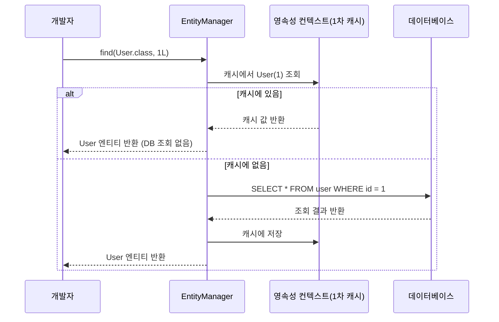

# `ORM`이 객체 중심의 `도메인 모델`과 `관계형 데이터베이스 테이블 구조` 사이의 `패러다임 불일치`를 해결하는 방식이 `Entity` 설계에 미치는 영향을 분석하시오.

---

# 1. 키워드 추출

- ORM
    - JPA/Hibernate
        - 지연 로딩 / 즉시 로딩
        - N+1 문제
- 도메인 모델
    - 애그리거트
    - 값 객체
- 테이블 구조
    - 식별자
- 패러다임 불일치
    - 인피던스 불일치
        - 상속 매핑

---

# 2. 키워드별 정리

## 0차 키워드

### ORM (Object-Relational Mapping)

> 데이터베이스와 객체 지향 프로그래밍 언어 간의 호환되지 않는 데이터를 변환하는 프로그래밍 기법
> 

SQL Query 대신 직관적인 코드로 데이터를 조작할 수 있게 해준다.

```sql
SELECT * FROM member WHERE id = 1;
```

```java
Member member = memberRepository.findById(1L);
```

**장점**

- 비즈니스 로직에 집중 가능: SQL의 절차적 접근 대신 객체 중심으로 개발
- 재사용성 및 유지보수 향상: ORM 객체는 독립적으로 작성되어 재활용 가능
- DBMS 종속성 감소: DB 종류가 바뀌어도 코드 변경 최소화

**단점**

- 복잡한 쿼리는 ORM만으로 표현하기 어려움 (네이티브 쿼리 병행 필요)
- 잘못 설계하면 N+1 문제 등 성능 이슈 발생
- 학습 곡선이 있으며, 내부 동작을 이해하지 못하면 디버깅이 어려움

---

### 도메인 모델

> 소프트웨어가 다뤄야 할 특정 도메인을 코드로 표현한 객체 모델
> 

단순히 데이터를 담는 구조체가 아니라, 비즈니스 규칙과 행위를 함께 포함한다

**구성 요소**

| 구성 요소 | 설명 |
| --- | --- |
| 엔티티 | 고유한 식별자(ID)를 가지며 생명주기를 갖는 객체. 상태가 변해도 동일 개체로 추적 |
| 값 객체 | 식별자 없이 값으로만 비교되는 불변 객체. 엔티티의 속성/특성을 표현 |
| 애그리거트 | 연관된 여러 객체를 하나의 논리적 단위로 묶은 것. 루트를 통해서만 내부 접근 가능 |
| 도메인 서비스 | 특정 엔티티에 속하기 애매한 도메인 로직을 처리 |
| 도메인 이벤트 | 도메인 내에서 발생한 사건. 서로 다른 애그리거트를 느슨하게 연결 |

---

### 관계형 데이터베이스 테이블 구조

> 데이터를 행(Row)과 열(Column)로 구성된 테이블에 저장하는 방식
> 

테이블 간의 관계는 외래 키(FK)로 표현하며, SQL로 데이터를 조작한다

**핵심 개념**

| 개념 | 설명 |
| --- | --- |
| 기본 키 (PK) | 테이블 내 각 행을 고유하게 식별하는 컬럼 |
| 외래 키 (FK) | 다른 테이블의 PK를 참조하여 테이블 간 관계를 표현하는 컬럼 |
| 정규화 | 데이터 중복을 줄이고 일관성을 유지하기 위해 테이블 구조를 분리하는 과정 |
| 조인 (JOIN) | 여러 테이블을 연결하여 관련 데이터를 함께 조회하는 연산 |

---

### 패러다임 불일치 (Impedance Mismatch)

> 객체 지향 프로그래밍과 관계형 데이터베이스가 데이터를 표현하는 방식이 근본적으로 달라 발생하는 구조적 충돌
> 

ORM이 해결하려는 핵심 문제로, 원래 전기공학 용어인 "임피던스 불일치(Impedance Mismatch)"에서 차용한 개념으로,
두 시스템 간의 인터페이스가 맞지 않아 에너지(데이터)가 손실되는 현상을 비유한다.

**불일치의 네 가지 유형**

| 유형 | 객체 세계 | RDB 세계 |
| --- | --- | --- |
| 상속 | 클래스 상속 계층 구조가 존재 | 상속 개념 없음 |
| 연관관계 | 참조(Reference)로 관계 표현, 방향성 존재 | 외래 키(FK)로 관계 표현, 방향성 없음 |
| 그래프 탐색 | 참조를 따라 자유롭게 객체 탐색 가능 | 처음 실행한 SQL 범위 내에서만 탐색 가능 |
| 동일성 비교 | 동일성(==)과 동등성(equals())을 구분 | PK 값이 같으면 동일한 레코드로 취급 |

---

### Entity

> 데이터베이스 테이블과 매핑되는 클래스
> 

ORM은 Entity를 통해서 패러다임 불일치를 해소한다. 도메인 모델의 엔티티 개념과 유사하지만, JPA Entity는 영속성(Persistence) 관리라는 기술적 역할이 추가된다.

```java
@Entity
public class Member {
    @Id @GeneratedValue
    private Long id;

    private String name;

    @ManyToOne(fetch = FetchType.LAZY)
    private Team team;
}
```

---

## 1차 키워드

### JPA / Hibernate

> **JPA (Java Persistence API) :** 자바의 ORM 기술 표준으로, 인터페이스의 모음
 
Hibernate : JPA의 구현체 종류 중 하나로, 가장 많이 쓰이는 구현체
> 

JPA는 개발자가 SQL을 직접 작성하지 않아도 되도록 추상화 계층을 제공하며, 영속성 컨텍스트를 통해 객체의 생명주기를 관리한다.

**영속성 컨텍스트**



Entity를 영구 저장하는 환경으로, JPA가 관리하는 1차 캐시 역할을 한다. 같은 트랜잭션 내에서 같은 PK로 조회하면 DB를 다시 조회하지 않고 컨텍스트에서 반환하므로 동일성이 보장된다.

---

### 애그리거트 (Aggregate)

> 연관된 여러 객체를 하나의 논리적 단위로 묶은 것
> 

외부에서는 **애그리거트 루트(Aggregate Root)** 를 통해서만 내부에 접근할 수 있다.

```
Order (애그리거트 루트)
├── OrderItem
├── OrderItem
└── ShippingInfo (값 객체)
```

- 트랜잭션 범위가 애그리거트 경계를 넘지 않도록 제한
- 루트 엔티티가 내부의 일관성(불변 조건)을 관리
- JPA에서 애그리거트를 표현할 때, 루트만 Repository를 갖는 것이 원칙

---

### 값 객체 (Value Object)

> 고유 식별자 없이 내부 값으로만 동일성을 판단하는 불변 객체
> 

```java
// 값 객체 예시: Address
@Embeddable
public class Address {
    private String city;
    private String street;
    private String zipcode;
    // equals/hashCode를 값 기준으로 구현
}
```

- 불변으로 설계하여 부작용 방지
- JPA에서는 `@Embeddable` / `@Embedded`로 표현하며, 별도 테이블 없이 엔티티 테이블에 컬럼으로 저장됨
- 두 Address의 city, street, zipcode가 모두 같으면 동일한 값 객체로 취급

---

### 식별자 (PK / FK)

**기본 키(PK)** 는 엔티티를 고유하게 식별하며, JPA에서 `@Id`로 매핑한다. 생성 전략은 네 가지가 있다.

| 전략 | 설명 | 적합한 DB |
| --- | --- | --- |
| IDENTITY | DB의 AUTO_INCREMENT에 위임 | MySQL, PostgreSQL |
| SEQUENCE | DB 시퀀스 오브젝트 사용 | Oracle, PostgreSQL |
| TABLE | 키 생성 전용 테이블 사용 | 모든 DB (성능 낮음) |
| AUTO | DB 방언에 따라 자동 선택 | 기본값 |

**외래 키(FK)** 는 JPA에서 `@JoinColumn`으로 매핑한다. 연관관계의 주인(Owner) 쪽에서 FK를 관리한다.

---

### 임피던스 불일치 (Impedance Mismatch)

패러다임 불일치의 원래 용어이다. 전기공학에서 두 회로의 임피던스가 맞지 않으면 신호 손실이 생기는 현상에서 유래했다. 객체 모델과 관계형 모델이 서로 다른 패러다임을 가지고 있어 그대로 연결하면 데이터 표현에 손실이나 왜곡이 생긴다는 점을 비유한 용어다.

---

## 2차 키워드

### 지연 로딩 / 즉시 로딩 (LAZY / EAGER)

연관된 객체를 언제 DB에서 불러올지 결정하는 전략이다.

| 전략 | 설명 | 특징 |
| --- | --- | --- |
| 즉시 로딩 (EAGER) | 엔티티 조회 시 연관 객체를 즉시 함께 조회 | 예상치 못한 JOIN 쿼리 발생 가능 |
| 지연 로딩 (LAZY) | 연관 객체를 실제로 사용할 때 조회 | 프록시 객체를 사용하여 필요한 시점에 쿼리 실행 |

실무에서는 기본적으로 **지연 로딩(LAZY)** 을 사용하고, 필요한 경우 페치 조인(Fetch Join)으로 최적화하는 것이 권장된다.

```java
@ManyToOne(fetch = FetchType.LAZY)  // 지연 로딩
private Team team;
```

---

### N+1 문제

1번의 쿼리로 N개의 결과를 가져온 뒤, 각 결과에 대해 연관 데이터를 조회하는 쿼리가 N번 추가 실행되는 성능 문제다.

```
// 회원 목록 조회 (1번)
SELECT * FROM member;

// 각 회원의 팀 조회 (N번)
SELECT * FROM team WHERE id = 1;
SELECT * FROM team WHERE id = 2;
SELECT * FROM team WHERE id = 3;
...
```

**해결 방법**

| 방법 | 설명 |
| --- | --- |
| 페치 조인 (Fetch Join) | JPQL에서 JOIN FETCH로 연관 데이터를 한 번에 조회 |
| @EntityGraph | 어노테이션으로 페치 조인과 동일한 효과 |
| 배치 사이즈 설정 | IN 절로 묶어서 쿼리 횟수를 줄임 |

---

### 상속 매핑 전략

객체의 상속 구조를 RDB 테이블로 표현하기 위한 세 가지 전략이다. `@Inheritance(strategy = ...)` 로 지정한다.

**예시 상속 구조**

```
Item (부모)
├── Book
├── Album
└── Movie
```

| 전략 | 설명 | 장점 | 단점 |
| --- | --- | --- | --- |
| SINGLE_TABLE | 모든 자식 클래스를 하나의 테이블에 저장, DTYPE 컬럼으로 구분 | 조인 없이 조회 가능, 성능 좋음 | 자식 고유 컬럼이 모두 NULL 허용이어야 함 |
| JOINED | 부모/자식 테이블을 각각 만들고 PK를 공유하여 조인으로 조회 | 정규화된 구조, NULL 없음 | 조회 시 조인 필요, 쿼리 복잡도 증가 |
| TABLE_PER_CLASS | 자식 클래스마다 독립적인 테이블 생성, 부모 컬럼 중복 포함 | 조인 없이 조회 | 부모 타입으로 조회 시 UNION 필요, 비효율적 |

실무에서는 **조인 전략** 또는 **단일 테이블 전략**을 주로 사용하며, 테이블-퍼-클래스 전략은 권장되지 않는다.

---

# 3. 핵심 주제: ORM이 패러다임 불일치를 어떻게 해결하는가?

ORM은 패러다임 불일치의 네 가지 문제를 각각 다른 방식으로 해소하며, 이 과정에서 Entity 설계에 구체적인 제약과 결정 사항을 부여한다.

## 1) 상속 불일치 → 상속 매핑 전략 제공

RDB에는 상속 개념이 없기 때문에, 객체의 상속 계층을 테이블로 표현하려면 세 가지 전략 중 하나를 선택해야 한다. 어떤 전략을 선택하느냐에 따라 테이블 수, 조인 여부, NULL 허용 여부가 결정된다.

- 단순하고 성능이 중요하다면 단일 테이블 전략
- 정규화와 데이터 무결성이 중요하다면 조인 전략

## 2) 연관관계 불일치 → 연관관계 매핑과 주인 설정

객체는 참조로 방향성을 가지지만, RDB의 FK는 방향이 없다. 방향이 없다는 것은 어느쪽에서든 조회할 수 있다는 것을 의미한다. FK하나만 있다면, FK가 주식별자인 테이블과 FK를 가지고 있는 테이블에 접근이 가능하다는 의미이다. 

ORM은 단방향/양방향 매핑으로 이를 해소하지만, 양방향 매핑 시 **연관관계의 주인(Owner)** 을 명확히 지정해야 한다. 주인만이 FK를 관리하며, 주인이 아닌 쪽은 읽기 전용이다.

```java
// 주인 (FK 관리)
@ManyToOne
@JoinColumn(name = "team_id")
private Team team;

// 주인 아님 (읽기 전용, mappedBy 필수)
@OneToMany(mappedBy = "team")
private List<Member> members;
```

## 3) 그래프 탐색 불일치 → 로딩 전략 설계

객체는 참조를 따라 자유롭게 탐색할 수 있지만, JPA는 처음 조회한 SQL 범위 밖의 객체를 자동으로 가져오지 않는다. 이를 해결하기 위해 **지연 로딩(LAZY)** 을 기본으로 설정하고, 필요한 경우 fetch-join으로 한 번에 가져오는 전략이 필요하다. 잘못 설계하면 N+1 문제로 이어진다.

## 4) 동일성 불일치 → 식별자 전략과 영속성 컨텍스트

RDB는 PK 값이 같으면 같은 레코드이지만, 자바 객체는 `==`(주소)와 `equals()`(값)를 구분한다. JPA는 **영속성 컨텍스트** 를 통해 같은 트랜잭션 내에서 같은 PK로 조회하면 항상 동일한 인스턴스를 반환하여 이 문제를 해소한다.

---

### ORM 없이 JDBC만 쓸 때

**Entity는 그냥 데이터 담는 클래스**였고

```java
public class Member {
    private Long id;
    private String name;
    private Long teamId;
}
```

**패러다임 불일치는 개발자가 직접 해결해야 했는데, 이게 상당히 복잡했다.**

```java
String sql1 = "INSERT INTO item VALUES (?, ?, ?)";
String sql2 = "INSERT INTO book VALUES (?, ?)";

member.setTeamId(10L);
pstmt.setLong(3, member.getTeamId());

Team team = findTeamById(member.getTeamId());

if (a.getId().equals(b.getId())) { ... }
```

---

### ORM 도입 후

**Entity는 매핑 정보와 설계 결정을 담은 선언적 클래스**로 바뀌었어요.

```java
// ORM 있을 때 Entity
@Entity
@Inheritance(strategy = InheritanceType.JOINED) 
public class Member {
    @Id @GeneratedValue(strategy = GenerationType.IDENTITY)
    private Long id;
    
    private String name;
    
    @ManyToOne(fetch = FetchType.LAZY)
    @JoinColumn(name = "team_id")
    private Team team;
}
```

**패러다임 불일치는 ORM이 자동으로 해결:**

```java
memberRepository.save(book);

member.setTeam(team);

String teamName = member.getTeam().getName();

Member a = em.find(Member.class, 1L);
Member b = em.find(Member.class, 1L);
```

### ORM이 Entity 설계에 미친 영향

| 측면 | ORM 없을 때 | ORM 있을 때 | 영향 |
| --- | --- | --- | --- |
| **Entity의 역할** | 단순 데이터 클래스 | 매핑 정보 + 설계 결정을 담은 선언적 클래스 | 역할 확대 |
| **상속 표현** | 개발자가 SQL 2개 직접 작성 | `@Inheritance` 전략만 선택하면 ORM이 자동 처리 | 선언적으로 변경 |
| **연관관계** | FK를 숫자(Long)로 가짐 | 객체 참조로 가짐, `mappedBy`로 주인 지정 | 객체지향적으로 변경 |
| **탐색** | SQL 직접 작성 | `FetchType` 선택, ORM이 필요 시 자동 조회 | 전략 선택으로 변경 |
| **동일성** | 개발자가 직접 비교 로직 작성 | 영속성 컨텍스트가 자동 보장 | 자동화됨 |

---

# 4. 회고

ORM 도입 전 JDBC를 통해서 자바 객체를 데이터베이스에 담는 코드를 살펴보면 복잡하고, 실제로 자바 객체보다 테이블의 데이터를 다룬다는 느낌이 강했다. 또한 테이블의 구조가 바뀌면 그에 따라 쿼리문도 일일이 바꿔줘야 되고, 여러 번거로움이 발생하는데, ORM으로 인해서 개발자의 수고가 덜여졌다는 것을 코드를 통해서 확인할 수 있었다. 또한 지금 진행하고 있는 과제에서 적용할만한 포인트들이 많은 주제라서 흥미롭게 준비할 수 있었다.

다만 아쉬운게 있다면 키워드를 추출할때 모르는 단어 위주로 추출을 하다보니까 점점 주제와 무관한 방향으로 흘러가서 중간에 엎었는데, 앞으로 딥다이브를 한다면 강의때 배운 내용이더라도 주제 설명을 위해 꼭 필요한 키워드라면 포함시켜야겠다.

---

### 0차 키워드

**ORM / 패러다임 불일치**

- ORM과 패러다임 불일치 개념 전반: https://velog.io/@hajieun02/ORM%EA%B3%BC-%ED%8C%A8%EB%9F%AC%EB%8B%A4%EC%9E%84%EC%9D%98-%EB%B6%88%EC%9D%BC%EC%B9%98-JPA
- JPA와 패러다임 불일치 (불일치 4가지 유형): https://djcho.github.io/jpa/jpa-chapter1-2/
- JPA와 패러다임 불일치 (상속/연관관계 중심): https://bravenamme.github.io/2020/09/09/jpa_2/
- JPA 이해하기 (4가지 불일치 + JPA 해결 방식): https://sgc109.github.io/2020/07/26/jpa-basic/

**도메인 모델 + JPA Entity 분리 관점**

- 도메인 모델과 JPA 영속 모델, 함께 쓸 것인가 분리할 것인가: https://medium.com/@jazzbach/%EB%8F%84%EB%A9%94%EC%9D%B8-%EB%AA%A8%EB%8D%B8%EA%B3%BC-jpa-e1d602b4a526
- 도메인 모델 패턴 JPA 적용 (Aggregate + VO): https://velog.io/@hongjunland/%EB%8F%84%EB%A9%94%EC%9D%B8-%EB%AA%A8%EB%8D%B8-%ED%8C%A8%ED%84%B4-%EC%A0%81%EC%9A%A9-1-JPA-Aggregate-VO

---

### 1차 키워드

**JPA / Hibernate + 영속성 컨텍스트**

- 영속성 컨텍스트 개념과 동작 방식: https://velog.io/@suk13574/JPA-%EC%98%81%EC%86%8D%EC%84%B1-%EC%BB%A8%ED%85%8D%EC%8A%A4%ED%8A%B8%EC%9D%98-%EC%A0%84%EB%B0%98%EC%A0%81%EC%9D%B8-%EC%9D%B4%ED%95%B4%EA%B0%9C%EB%85%90-%EC%9E%A5%EC%A0%90-%EB%8F%99%EC%9E%91-%EB%B0%A9
- 1차 캐시와 동일성 보장 예제: https://velog.io/@conatuseus/%EC%98%81%EC%86%8D%EC%84%B1-%EC%BB%A8%ED%85%8D%EC%8A%A4%ED%8A%B8-2-ipk07xrnoe

**값 객체 (@Embeddable)**

- @Embedded / @Embeddable 사용법: https://velog.io/@uiurihappy/Spring-JPA-JPA-Embedded-Embeddable-%EC%82%AC%EC%9A%A9%EA%B8%B0
- 값 객체와 임베디드 타입 (객체지향 설계 관점): https://cheese10yun.github.io/jpa-embedded/
- JPA 밸류와 @Embeddable (책 기반 정리): https://gunju-ko.github.io/jpa/2022/01/22/JPA-%ED%94%84%EB%A1%9C%EA%B7%B8%EB%9E%98%EB%B0%8D-%EC%9E%85%EB%AC%B8-chapter-4-%EB%B0%B8%EB%A5%98%EC%99%80-@Embeddable.html

**식별자 전략 (@GeneratedValue)**

- 기본 키 매핑 방법 및 생성 전략 정리: https://gmlwjd9405.github.io/2019/08/12/primary-key-mapping.html
- IDENTITY / SEQUENCE / TABLE / AUTO 상세 비교: https://velog.io/@gillog/JPA-%EA%B8%B0%EB%B3%B8-%ED%82%A4-%EC%83%9D%EC%84%B1-%EC%A0%84%EB%9E%B5IDENTITY-SEQUENCE-TABLE
- AUTO 전략의 동작 원리와 주의점: https://velog.io/@power0080/JPA%EC%9D%98-GeneratedValue%EC%9D%98-AUTO-%EC%A0%84%EB%9E%B5-%EC%9D%B4%EA%B1%B4-%EB%AD%90%EC%A3%A0

---

### 2차 키워드

**지연 로딩 / N+1 문제**

- N+1 문제 총정리 (즉시/지연 로딩 모두 발생): https://medium.com/sjk5766/jpa-n-1-%EB%AC%B8%EC%A0%9C-%EC%A0%95%EB%A6%AC-d84d50a1b67a
- N+1 발생 원인과 해결 방법 (Yun Blog): https://cheese10yun.github.io/jpa-nplus-1/
- N+1 해결 및 성능 비교 (Fetch Join vs BatchSize): https://velog.io/@lord/JPA-N1-%EB%AC%B8%EC%A0%9C-%ED%95%B4%EA%B2%B0-%EB%B0%8F-%EC%84%B1%EB%8A%A5-%EB%B9%84%EA%B5%90%ED%95%98%EA%B8%B0
- N+1 문제 해결 전략 총정리 (Fetch Join + EntityGraph): https://f-lab.kr/insight/jpa-n-plus-one-problem-and-solutions

**상속 매핑 전략**

- 상속관계 매핑 3가지 전략 비교 (한국어): https://velog.io/@imcool2551/JPA-%EC%83%81%EC%86%8D%EA%B4%80%EA%B3%84-%EB%A7%A4%ED%95%91
- SINGLE_TABLE / JOINED / TABLE_PER_CLASS 코드 예제 (영어): https://medium.com/jpa-java-persistence-api-guide/hibernate-work-with-inheritance-strategies-single-table-table-per-class-joined-examples-33dca084abbb

**연관관계 매핑 / 연관관계 주인**

- 단방향/양방향 연관관계와 mappedBy 개념: https://velog.io/@hyojhand/JPA-%EC%97%B0%EA%B4%80%EA%B4%80%EA%B3%84-%EB%A7%A4%ED%95%91-%EB%8B%A8%EB%B0%A9%ED%96%A5%EC%96%91%EB%B0%A9%ED%96%A5-%EC%97%B0%EA%B4%80%EA%B4%80%EA%B3%84-%EC%A3%BC%EC%9D%B8
- 양방향 매핑에서 mappedBy가 필요한 이유: https://velog.io/@conatuseus/%EC%97%B0%EA%B4%80%EA%B4%80%EA%B3%84-%EB%A7%A4%ED%95%91-%EA%B8%B0%EC%B4%88-2-%EC%96%91%EB%B0%A9%ED%96%A5-%EC%97%B0%EA%B4%80%EA%B4%80%EA%B3%84%EC%99%80-%EC%97%B0%EA%B4%80%EA%B4%80%EA%B3%84%EC%9D%98-%EC%A3%BC%EC%9D%B8
- 연관관계 주인 설정 이유와 FK 관리: https://velog.io/@dkajffkem/MappedBy-%EC%96%91%EB%B0%A9%ED%96%A5-%EC%97%B0%EA%B4%80%EA%B4%80%EA%B3%84-%EC%A3%BC%EC%9D%B8%EC%9D%84-%EC%84%A4%EC%A0%95%ED%95%98%EB%8A%94-%EC%9D%B4%EC%9C%A0
