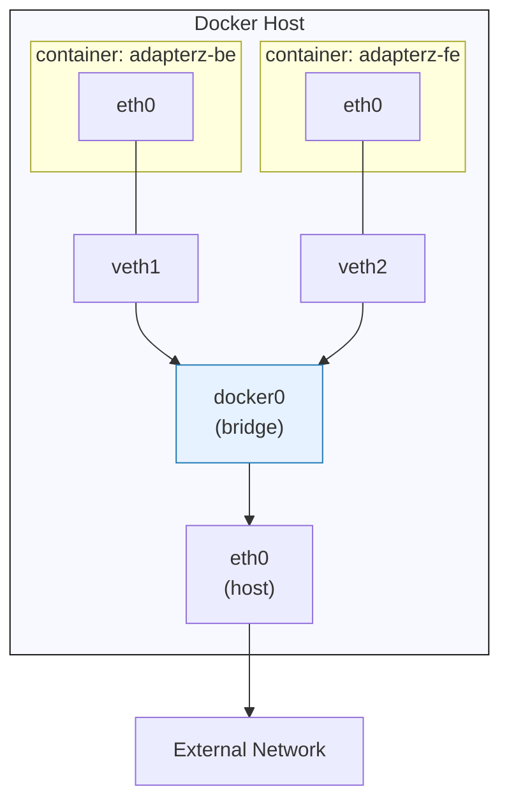

# 1. Bridge Network



## 핵심 개념

> 컨테이너들이 동일한 호스트 내에서 서로 통신할 수 있도록 연결해주는 Docker의 기본 가상 네트워크
> 
> 
> 실제 서비스는 하나의 프로그램으로 구성되지 않는다. Nginx, API, MySQL처럼 여러 컨테이너가 서로 통신해야 하는데, 모든 컨테이너를 그냥 호스트 네트워크에 연결하면 관리·보안 문제가 생긴다. 그래서 Docker는 컨테이너마다 독립적인 네트워크 환경을 만들고, 필요한 컨테이너끼리만 같은 네트워크로 묶을 수 있게 한다.
> 

## 왜 필요한가

여러 컨테이너 간 통신은 목적에 따라 나뉜다.

| 통신 주체 | 목적 |
| --- | --- |
| 사용자 → Nginx | 웹사이트 또는 API 요청 |
| Nginx → API | 리버스 프록시 요청 전달 |
| API → MySQL | 데이터 조회 및 저장 |
| API → 외부 인터넷 | 외부 API 호출, 패키지 다운로드 등 |

모든 컨테이너를 호스트 네트워크에 그대로 연결하면 아래 문제가 발생한다.

| 문제 | 내용 |
| --- | --- |
| 관리 어려움 | 어떤 컨테이너가 어떤 포트를 쓰는지 파악하기 힘듦 |
| 보안 노출 | MySQL처럼 보안이 중요한 컨테이너가 외부 인터넷에 노출될 수 있음 |
| 연결 설정 불안정 | 컨테이너는 삭제·재생성이 잦아 IP가 새로 할당되고, 연결 설정이 깨질 수 있음 |
| 의도치 않은 통신 | 한 호스트에 여러 프로젝트(Memo App, Portainer 등)가 떠 있으면 서로 브로드캐스트 등으로 의도치 않게 통신할 수 있음 |

이런 문제 때문에 Docker는 Bridge Network로 컨테이너별 네트워크 환경을 분리한다.

## 이해해야 하는 개념

### 1. Host란

> Docker 호스트는 컨테이너를 실행하고 관리하는 기반 컴퓨터
> 
> 
> 컨테이너는 호스트의 CPU·Memory·Network 자원을 함께 공유해서 사용하지만, 가능한 서로 분리된 환경에서 실행된다.
> 
- 호스트는 Docker Engine이 실행되는 실제 서버(Linux 머신) — EC2, Macbook 등
- 예: EC2 Ubuntu Server = Docker Host, 그 위의 Nginx·Spring·MySQL = Container

### 2. 네트워크 인터페이스

네트워크 통신을 위한 출입구다. 사람이 집 밖을 나가려면 현관문을 쓰듯, 컴퓨터와 컨테이너도 통신하려면 네트워크 인터페이스가 필요하다.

| 구분 | 예시 | 의미 |
| --- | --- | --- |
| 물리 네트워크 인터페이스 | `eth0`, `ens5`, `enp0s3` | 실제 서버가 VPC·인터넷·사내망과 연결되는 출입구 |
| 가상 네트워크 인터페이스 | 컨테이너 내부의 `eth0` | 컨테이너가 네트워크를 사용하는 출입구 |
| Docker 브리지 인터페이스 | `docker0`, `br-...` | 여러 컨테이너의 가상 인터페이스를 연결하는 가상 스위치 |

### 3. 컨테이너는 자신의 네트워크 공간을 가진다

Bridge network에 연결된 컨테이너는 각자 아래 정보를 갖는다.

- 자신의 네트워크 인터페이스
- 자신의 IP 주소
- 자신의 기본 게이트웨이
- 자신의 라우팅 테이블
- DNS 설정

```
Nginx 컨테이너
└── eth0: 172.18.0.2

API 컨테이너
└── eth0: 172.18.0.3

MySQL 컨테이너
└── eth0: 172.18.0.4
```

- 컨테이너 생성 시 네트워크별 IP가 자동 할당된다.
- 각 네트워크에는 서브넷 + 기본 게이트웨이가 설정된다.
- 컨테이너 IP는 컨테이너가 재생성될 때마다 바뀐다.

## Bridge Network의 구조


Bridge Network는 실제 네트워크 장비를 통한 네트워크가 아니라, 리눅스 + Docker 소프트웨어로 만든 가상 네트워크다.

| 구성 요소 | 역할 | 비유 |
| --- | --- | --- |
| 컨테이너 `eth0` | 컨테이너 내부 네트워크 출입구 | 각 집의 현관문 |
| veth pair | 컨테이너와 호스트를 연결하는 가상 케이블 | 집과 단지를 연결하는 케이블 |
| Docker Bridge | 같은 네트워크의 컨테이너를 연결하는 가상 스위치 | 아파트 단지 내부 스위치 |
| Host NIC | 호스트가 외부 네트워크와 통신하는 실제 인터페이스 | 단지 밖으로 나가는 출입구 |

> 컨테이너 내부에서 보이는 `eth0`이 실제로 호스트의 NIC에 바로 연결되는 것이 아니다. 컨테이너는 먼저 Docker Bridge에 연결되고, 외부 통신이 필요할 때 호스트의 라우팅·NAT·방화벽 규칙을 통과해서 실제 네트워크 인터페이스로 나간다.
> 

### 같은 브릿지 네트워크 내부 통신


Nginx는 API 컨테이너의 IP를 알 필요가 없다. Bridge Network가 컨테이너 이름 ↔ IP를 DNS로 등록해서 관리해주기 때문이다. 같은 네트워크라면 `-p` 옵션 없이도 통신 가능하다.

```bash
docker run -d \
  --name api \
  --network app-net \
  my-api:latest
```

```
# nginx 설정
proxy_pass http://api:8080;
```

API의 외부 포트를 열지 않으면:

```
Nginx → api:8080     가능
호스트 → api:8080     가능
외부 사용자 → api:8080  불가능
```

## 기본 Bridge vs 사용자 정의 Bridge

Docker를 설치하면 기본 Bridge가 자동 생성되고(`docker network ls`로 확인), 컨테이너 실행 시 `--network` 옵션을 주지 않으면 기본 bridge가 할당된다. 하지만 실무에서는 사용자 정의 bridge를 더 선호한다.

| 비교 항목 | 기본 `bridge` 네트워크 | 사용자 정의 브리지 네트워크 |
| --- | --- | --- |
| 생성 방식 | Docker 설치 시 자동 생성 | `docker network create`로 생성 |
| 컨테이너 이름 DNS | 기본적으로 지원하지 않음 | 지원 |
| 네트워크 분리 | 모든 기본 컨테이너가 같은 네트워크에 들어갈 수 있음 | 필요한 서비스끼리만 묶을 수 있음 |
| 실행 중 연결/해제 | 제한적 | `docker network connect`, `disconnect` 가능 |
| 실무 권장도 | 단순 테스트용 | 서비스 단위 구성에 권장 |

사용자 정의 브릿지를 선호하는 이유: 자동 DNS, 높은 격리 수준, 실행 중 연결/해제 가능.

## 네트워크 명령어

### 생성 관련

```bash
docker network create app-net

# 명시적으로 bridge 드라이버 지정
docker network create --driver bridge app-net

# 네트워크 스펙 확인
docker network inspect app-net
```

| 항목 | 의미 |
| --- | --- |
| `Driver` | 네트워크 드라이버 종류 |
| `Subnet` | 컨테이너에 할당할 IP 범위 |
| `Gateway` | 컨테이너의 기본 게이트웨이 |
| `Containers` | 연결된 컨테이너 목록 |
| `IPv4Address` | 각 컨테이너에 할당된 IP |

### 연결·연결 해제

```bash
docker network connect app-net nginx-3
docker network disconnect app-net nginx-3
```

## 실무적인 구조 패턴

### 1. Network Segmentation

Nginx – API – MySQL을 분리한다. API 컨테이너를 두 개의 네트워크에 걸치게 해서:

- Nginx → API : 가능
- API → DB : 가능
- Nginx → DB : 불가능

### 2. 사이드카 패턴

메인 컨테이너 옆에 보조 컨테이너를 두는 방식. 로그, 모니터링, 프록시, 보안, 포매팅 등 공통 관심사를 분리한다.

### 3. 워커 패턴

사용자 요청을 바로 처리하지 않고, API·메시지 브로커 등을 별도 네트워크로 분리해서 비동기로 작업을 처리하는 패턴.

## 실무적으로 잘 사용하기

1. **기본 브릿지보다 사용자 정의 브릿지 사용** — 컨테이너 이름 DNS, 프로젝트별 통신 범위 분리, IP 변경 시에도 자동 DNS 반영, 실행 중 네트워크 연결/분리 가능
2. **컨테이너 IP를 설정 값에 하드코딩하지 않는다**

```bash
# ❌ 비권장
DB_HOST=172.24.0.3

# ✅ 권장 — Bridge DNS로 컨테이너 이름 사용
DB_HOST=mysql
```

## Bridge Network 정리

| 구분 | 핵심 |
| --- | --- |
| 정의 | 한 도커 호스트 안에서 컨테이너를 연결하는 가상 내부 네트워크 |
| 특징 | 컨테이너는 각자 IP·Network Interface를 가진 독립적인 네트워크 환경 |
| 내부 통신 | 같은 브리지 네트워크에 있는 컨테이너끼리는 이름 기반(DNS)으로 통신 가능 |
| 외부 노출 | 외부에 공개할 서비스만 `-p`로 호스트 포트와 연결해야 함 |
| 권장 사항 | 기본 브릿지보단 사용자 정의 브릿지 사용 |

---

# 2. 추가 개념: Docker Network Driver 종류

| 드라이버 | 통신 범위 |
| --- | --- |
| bridge | 한 대의 Docker Host |
| host | 호스트 네트워크 직접 공유 |
| overlay | 여러 Docker Host |
| macvlan | 물리 네트워크에 직접 연결된 것처럼 동작 |

## Bridge Driver

> 도커 호스트 내에서 컨테이너를 가상의 스위치로 연결하는 네트워크 드라이버
> 

지금까지 다룬 Bridge Network의 기본 드라이버다.

## Host Network

> 컨테이너가 별도 네트워크를 만들지 않고, 호스트의 네트워크 공간을 "직접" 공유하는 방식
> 

Host Network에서는 컨테이너가 별도의 IP를 할당받지 않고 호스트의 IP를 그대로 사용한다.

```
Bridge
컨테이너: 172.18.0.2:80
호스트:   10.0.1.10:8080
외부:     10.0.1.10:8080 → 컨테이너 80

Host
컨테이너: 별도 IP 없음
호스트:   10.0.1.10:80
외부:     10.0.1.10:80 → 컨테이너 프로세스
```

| 구분 | 내용 |
| --- | --- |
| 장점 | Bridge보다 네트워크 경로가 단순, NAT·포트 매핑 불필요, 호스트의 localhost에 직접 접근해야 할 때 유리 |
| 단점 | 컨테이너와 호스트의 네트워크 격리가 사라짐, 호스트가 점유 중인 포트는 컨테이너가 사용 불가(예: 호스트 Nginx가 80 사용 중이면 컨테이너는 80 사용 못함), 여러 서비스가 한 서버에 공존할 때 사용하기 어려움 |

## Overlay Network

> 여러 Docker Host에 흩어져 있는 컨테이너를 하나의 가상 내부망처럼 연결하는 네트워크
> 

Bridge는 한 대의 호스트 안에서만 동작한다 (예: EC2 한 대 안의 Nginx ↔ API ↔ MySQL). 컨테이너가 여러 호스트로 분리되어 있으면 Bridge로는 연결할 수 없다. Overlay는 여러 EC2에 분산된 서비스 컨테이너를 연결하고, 서비스가 다른 호스트로 이동해도 같은 오버레이 네트워크라면 통신을 유지할 수 있게 해준다.

- Overlay는 주로 Docker Swarm에서 사용 (`docker swarm init`, `docker swarm join`)

| 포트 | 프로토콜 | 용도 |
| --- | --- | --- |
| `2377` | TCP | Swarm 관리 제어 통신 |
| `7946` | TCP / UDP | 노드 간 통신 |
| `4789` | UDP | Overlay 데이터 경로 |

### Bridge vs Overlay

| 구분 | Bridge | Overlay |
| --- | --- | --- |
| 통신 범위 | 한 대의 Docker Host | 여러 Docker Host |
| 주 사용 환경 | Compose, 단일 EC2 | Swarm, 다중 서버 |
| 관리 복잡도 | 낮음 | 높음 |
| 네트워크 구성 | 로컬 가상 브리지 | 여러 호스트 위의 분산 가상망 |

## Macvlan Driver

> 컨테이너마다 별도의 MAC을 부여해서, 컨테이너가 마치 물리 네트워크에 직접 연결된 것처럼 보이게 하는 드라이버
> 

Bridge Network는 외부에서 컨테이너를 직접 볼 수 없다는 한계가 있는데, Macvlan은 레거시 애플리케이션이나 레거시 물리 장비와의 연동이 필요한 경우에 사용한다.
